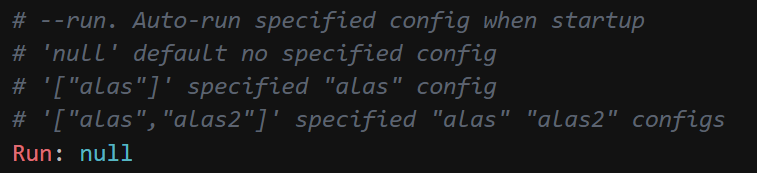

# Linux-X86-Conda-ALAS

> [!Tip]
> 本文默认读者对 Linux 下的命令行操作有基本了解；  
> 本文默认读者能正常访问 Github 与各官方库；  
> 如遇下载问题，请自行设置国内源或终端代理后再试。

在 X86_64 Linux 中使用 Conda 安装与配置 [AzurLaneAutoScript](https://github.com/LmeSzinc/AzurLaneAutoScript) 的指南

---

> [!NOTE]
> [Miniforge](https://conda-forge.org/) 是 Conda 环境的轻量级、跨平台发行版

## 1. 安装 Miniforge

```bash
# 下载 Miniforge 安装脚本
wget --show-progress -O Miniforge3-Linux-x86_64.sh https://github.com/conda-forge/miniforge/releases/latest/download/Miniforge3-Linux-x86_64.sh

# 运行安装脚本
bash Miniforge3-Linux-x86_64.sh -b

# 激活 Miniforge 临时环境
eval "$(~/miniforge3/bin/conda shell.bash hook)"

# 激活环境变量
source ~/.bashrc

# 检查 Miniforge 版本号
conda --version

# 删除 Miniforge 安装脚本
rm Miniforge3-Linux-x86_64.sh
```

> [!CAUTION]
> 警告：下列命令会将 Miniforge 写入至 PATH 中  
> 本教程不使用此方法，本处列出仅为告知

```bash
# 将 Miniforge 写入环境变量
~/miniforge3/bin/conda init bash
```

---

> [!NOTE]
> [Git](https://git-scm.com/) 和 [Adb](https://developer.android.google.cn/tools/adb) 是 ALAS 运行所需工具

## 2. 安装 Git 及 Adb

1. 安装 Git 和 Adb

<details open>
  <summary> Debian/Ubuntu </summary>

```bash
# 更新软件包列表并安装 Git 和 Adb，及相关依赖库
apt update && apt install -y git adb libgomp1 libgl1 libglib2.0-0t64 libgomp1 libsm6 libxrender1 libxext6
```

</details>

<details>
  <summary> Arch Linux </summary>

```bash
pacman -Syy --noconfirm git android-tools libgomp mesa glib2 libsm libxrender libxext
```

</details>

<details>
  <summary> CentOS/RHEL/Fedora </summary>

```bash
yum install -y git android-tools libgomp mesa-libGL glib2 libSM libXrender libXext
```

</details>

2. 验证安装

```bash
# 检查 Adb 版本号
adb --version

# 检查 Git 版本号
git --version
```

---

## 3. 拉取 AzurLaneAutoScript

```bash
# 使用 Git 拉取 ALAS
git clone https://github.com/LmeSzinc/AzurLaneAutoScript/

# 切换到 ALAS 目录
cd AzurLaneAutoScript
```

---

> [!NOTE]
> [environment.yml](./environment.yml) 定义了 ALAS 虚拟环境配置

## 4. 下载 environment.yml 文件

```bash
wget --show-progress -O environment.yml https://raw.githubusercontent.com/NEANC/Linux-X86-Conda-or-Pixi-ALAS/master/Conda/environment.yml
```

> [!TIP]
> 若下载失败可使用国内源/代理加速，若均失败请阅读 [附录 配置 environment.yml 文件](#附录-配置-environmentyml-文件)

---

> [!IMPORTANT]
> 如果部分依赖无法安装，请重复执行步骤 5-2

> [!WARNING]
> 步骤 5-2 与 Caution 部分必须在虚拟环境中运行

## 5. 创建并配置虚拟环境

1. 在 ALAS 目录下运行下列命令：

```bash
conda env create -f environment.yml
```

2. 如果部分依赖无法安装，出现类似 `No matching distribution found for XXX` 的报错:

- 在命令行使用 `conda install <无法安装的包名>` 独立安装，例如 `conda install python-graphviz==0.8.4`
  - 安装成功后，打开 `environment.yml` 文件，将对应依赖用 `#` 注释掉，例如 `#- python-graphviz==0.8.4`
    - 保存后在终端运行下列命令

    ```bash
    conda env update --name alas --file environment.yml
    ```

---

> [!IMPORTANT]
> 步骤 6. 需要在 ALAS 目录下操作  
> 该预设已经配置好地址与依赖路径，正常情况下无需再次修改

## 6. 配置 config/deploy.yaml

1. 在终端运行下列命令，重命名 `deploy.yaml` 文件

```bash
cp config/deploy.template-linux-cn.yaml config/deploy.yaml
```

---

## 7. 测试运行 ALAS

1. 激活环境

```bash
# 激活 ALAS 虚拟环境
conda activate alas
```

2. 进入脚本目录

```bash
cd AzurLaneAutoScript
```

3. 运行 GUI

```bash
python gui.py
```

4. 打开浏览器访问 `http://127.0.0.1:22267`，即可看到 ALAS WEB GUI

> [!CAUTION]
> 若报告未找到 `Git`、`Python`、`Adb` 路径，请阅读 [附录 填写依赖路径](#附录-填写依赖路径)

---

> [!CAUTION]
> 使用脚本运行前，必须进行下列操作：
>
> 1. 修改 `cd AzurLaneAutoScript` 为实际路径
> 2. 修改脚本文件权限 `chmod +x run_alas.sh`

## 8. 编写脚本并测试运行 ALAS

1. 下载脚本文件

```bash
wget --show-progress -O run_alas.sh https://raw.githubusercontent.com/NEANC/Linux-X86-Conda-or-Pixi-ALAS/master/Conda/run_alas.sh
```

2. 按注释编辑脚本文件

```bash
nano run_alas.sh
```

3. 修改脚本文件权限

```bash
chmod +x run_alas.sh
```

4. 运行脚本

```bash
./run_alas.sh
```

---

> [!IMPORTANT]
> 后续可以使用服务来运行 ALAS，避免终端关闭导致 ALAS 终止运行

> [!CAUTION]
> 使用服务运行前，必须进行下列操作：
>
> 1. 修改 `ExecStart=/root/run_alas.sh` 为实际路径  
> 2. 修改用户 `User=root` 为实际用户，例如 `User=neanc`  
> 3. 修改文件权限 `chmod 644 /etc/systemd/system/run_alas.service`

## 9. 配置开机自启

```bash
# 下载预设的 run_alas.service 文件
wget --show-progress -O /etc/systemd/system/run_alas.service https://raw.githubusercontent.com/NEANC/Linux-X86-Conda-or-Pixi-ALAS/master/Conda/run_alas.service

# 按注释修改配置文件
nano /etc/systemd/system/run_alas.service

# 修改权限
chmod 644 /etc/systemd/system/run_alas.service

# 重载 systemd 配置
systemctl daemon-reload

# 设置 run_alas 服务开机启动
systemctl enable run_alas.service

# 启动服务
systemctl start run_alas.service

# 查看服务状态
systemctl status run_alas.service
```

---

## 附录 ALAS 运行后自动运行指定配置

修改 `./config/deploy.yaml` 中的 `Run` 参数，示例已在配置中列出



---

## 附录 删除虚拟环境

```bash
# 退出虚拟环境
conda deactivate

# 查看虚拟环境列表
conda env list

# 删除 ALAS 虚拟环境
conda remove -n  alas --all

# 若重命名过 ALAS 虚拟环境，请自行参照下列命令自行删除虚拟环境
conda remove -n 需要删除的环境名 --all
```

---

## 附录 配置 environment.yml 文件

```bash
# 创建 environment.yml 文件
nano environment.yml
```

<details>
<summary>
📌 点击本行即可展开下列内容
</summary>

```yaml
name: alas
channels:
  - conda-forge
platforms:
  - linux-64
dependencies:
  - python=3.7.6=h87a0f07_5_cpython
  - av=8.1.0=py37h2f15689_2
  - numpy=1.16.6=py37h9768b45_0
  - scipy=1.4.1=py37h18f9736_2
  - pillow=8.4.0=py37h57d298f_0
  - psutil=5.9.3=py37h5415f19_0
  - pyyaml=6.0=py37h5415f19_4
  - tqdm=4.64.1=py37h89c1867_0
  - lz4=4.0.2=py37h373915f_0
  - pyzmq=22.3.0=py37h0d5d23d_0
  - openssl=1.1.11=h166bdaf_0
  - sqlite=3.41.2=h2797242_0
  - pip=22.3.1=py37h89c1867_0
  - setuptools=65.6.3=py37h89c1867_0
  - wheel=0.38.4=py37h89c1867_0
  - pip:
      - opencv-python==4.5.5.62
      - imageio==2.27.0
      - adbutils==0.11.0
      - uiautomator2==2.16.17
      - uiautomator2cache==0.3.0.1
      - wrapt==1.13.1
      - retrying==1.3.3
      - rich==11.2.0
      - jellyfish==0.11.2
      - inflection==0.5.1
      - pydantic==1.9.2
      - aiofiles==0.8.0
      - prettytable==2.2.1
      - anyio==1.3.1
      - onepush==1.4.0
      - pycryptodome==3.9.9
      - pypresence==4.2.1
      - cnocr==1.2.2
      - mxnet==1.6.0
      - pywebio==1.6.2
      - starlette==0.14.2
      - uvicorn==0.17.6
      - websockets==10.4
      - alas-webapp==0.3.7
      - zerorpc==0.6.3
```

</details>

---

## 附录 填写依赖路径

> [!TIP]
> 若未找到对应路径，请重启终端后再试

1. 在终端逐行运行下列命令，分别查看并记录 `Git`、`Python`、`Adb` 的安装路径

```bash
# 查找 Git
which git

# 查找 Python
which python

# 查找 Adb
which adb
```

2. 打开 ALAS 目录下的 `config/deploy.yaml` 文件，找到并替换路径

```yaml
Git:
    # Filepath of git executable `git.exe`
    # [Easy installer] Use './toolkit/Git/mingw64/bin/git.exe'
    # [Other] Use you own git
    GitExecutable: /usr/bin/git
    # 把 which git 得到的地址替换这里，例如/usr/bin/git

  Python:
    # Filepath of python executable `python.exe`
    # [Easy installer] Use './toolkit/python.exe'
    # [Other] Use you own python, and its version should be 3.7.6 64bit
    PythonExecutable: python
    # 把 which python 得到的地址替换这里，例如/opt/homebrew/Caskroom/miniforge/base/envs/alas/bin/python3

  Adb:
    # Filepath of ADB executable `adb.exe`
    # [Easy installer] Use './toolkit/Lib/site-packages/adbutils/binaries/adb.exe'
    # [Other] Use you own latest ADB, but not the ADB in your emulator
    AdbExecutable: /usr/bin/adb
    # 把 which adb 得到的地址替换这里
```

---

## 附录 终端单次临时代理设置

在终端中运行即可

```bash
# <port> 为代理端口
export http_proxy="http://127.0.0.1:<port>"
export https_proxy="http://127.0.0.1:<port>"
```
